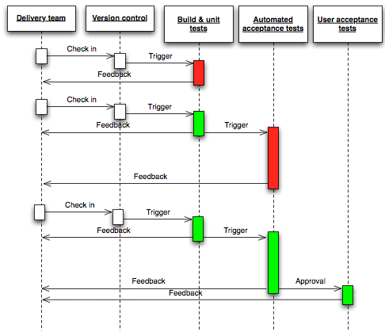

# Intégration Continue, Livraison Continue et Déploiement Continu

## Intégration Continue

L'intégration continue permet de **vérifier à chaque changement de code** que celui-ci **fonctionne correctement** sur une **environnement identique à celui de production** et sans perturber les autres fonctionnalités.

En eXtreme Programming, il est recommandé d'intégrer le plus fréquemment possible de petits changements afin d'en constater les conséquences le plus rapidement possible.

### Exemple

Chez Wishtack, suite à un changement, nous avons constaté une fuite mémoire sur l'environnement d'intégration après quelques minutes.

Le diagnostic et la correction ont pris quelques secondes :

1. Récupération de l'identifiant du changement _\(i.e. : commit git\)_ ayant introduit la fuite mémoire directement depuis l'outil de Monitoring.
2. Analyse du changement _\(contenu du commit\)_.
3. Il s'agissait d'un commit où seule une ligne avait changé pour intégrer une librairie externe victime de fuite mémoire.
4. Nous nous sommes débarrassé de la librairie pour trouver une solution alternative.

**Combien de temps et de claviers cassés cela aurait couté** si la fuite avait été découverte **à la livraison après plusieurs mois de développement** ?

Netflix raconte une fuite mémoire assez surprenante qui leur a couté une énergie considérable :

{% embed data="{\"url\":\"https://medium.com/netflix-techblog/node-js-in-flames-ddd073803aa4\",\"type\":\"link\",\"title\":\"Node.js in Flames\",\"description\":\"Flame Graphs to the Rescue\",\"icon\":{\"type\":\"icon\",\"url\":\"https://cdn-images-1.medium.com/fit/c/304/304/1\*ty4NvNrGg4ReETxqU2N3Og.png\",\"width\":152,\"height\":152,\"aspectRatio\":1},\"thumbnail\":{\"type\":\"thumbnail\",\"url\":\"https://cdn-images-1.medium.com/max/2000/0\*nirxOP9EGHyf02L1.\",\"width\":1068,\"height\":337,\"aspectRatio\":0.3155430711610487}}" %}

### Fonctionnement

1. A chaque modification, le développeur Check-In son code sur le Repository. 
2. A chaque Check-In, le produit est rebuild automatiquement et les résultats sont publiés. Les résultats doivent être accessibles à toute l'équipe. 
3. En cas de succès, les tests automatisés sont exécutés et les résultats publiés. 
4. En cas de succès, les serveurs d'intégration sont mis à jour.

## Livraison Continue

Les fonctionnalités validées par le "client" peuvent être publiées en production.

## Déploiement Continu

