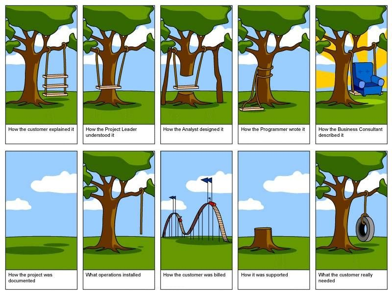
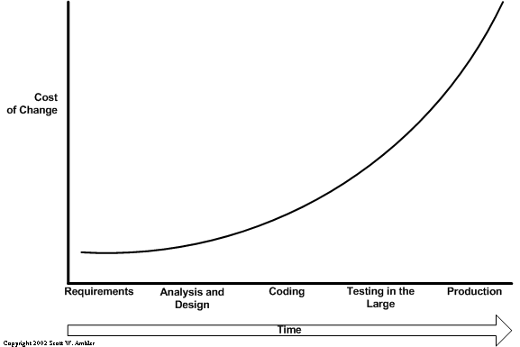

# Sans Agilité

## "Cycle" en racine carrée

### Le client exprime son besoin

avec une phrase...

> Je veux une application mobile pour un réseau social avec du rouge en couleur dominante.  
> Rendez-vous dans 6 mois.

... ou pire encore, avec un cahier des charges.

### 3 mois plus tard...

* Retards.
* Client déçu par la version beta.
* Trop tard pour tout remettre en question.
* Tensions avec le client et au sein de l'équipe.
* Le "lead developer" quitte l'entreprise.
* 3 nouveaux développeurs rejoignent l'équipe en renfort.
* Le renfort ralentit encore plus l'équipe.

  

## Coût du changement

Avec le cycle en V, le coût du changement augmente au fil du temps à travers le Software Development Life Cycle.

Il est donc plus difficile et plus cher de remédier à une erreur de conception à la livraison qu'au début des développements.

De même, sans méthode de développement, plus le développement avance, plus le code devient complexe et plus le changement est couteux.

## Conséquences techniques

* Peur du changement.
* Développement empirique.
* Complexité artificielle _\(i.e. : développement inutile ou inutilisable\)_.
* L'équipe est débordée par la correction de bugs.
  * La correction d'un bug en provoque un autre.
* Plusieurs fonctionnalités en cours de développement mais aucune de finalisée.

## Conséquences organisationnelles et humaines

* Manque de satisfaction.
* Tension et conflits.
* Vélocité de l'équipe en diminution permanente.
* Dé-responsabilisation des développeurs et compétition au sein même de l'équipe.
* Problèmes de priorisation des tâches.
* Décisions maladroites dans la panique.
* Le "deadlock" humain.

